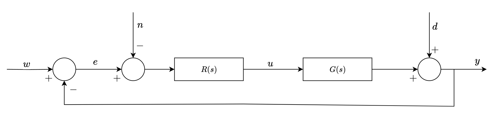

# MATLAB functions for control theory

### Why this repo?
I developed these MATLAB functions while studying for the **control theory exam**, where laptops were allowed during the test. They turned out to be helpful—not just for solving problems during the exam, but also for better understanding the core concepts.

### Acknowledgments
I would like to thank my two colleagues, [AleTopp](https://github.com/AleTopp) and [Agda78](https://github.com/Agda78), who respectively wrote the `tb.m` and `Cld.m` functions.

### Usage
To use the functions you have to **add them to the path**
```matlab
>> addpath(genpath('path/to/functions'));
```

### Documentation
All the functions, except for the self-explanatory ones, include a **help message** to clarify their purpose.
The only function I want to explain in more detail is `loopspecs` (since it's the most complex), and I’ll briefly cover it here.
##### Loopspecs
Let’s assume we need to control a process $G(s)$ using a regulator $R(s)$ according to the following schema:


In the Laplace domain, the expression for $y$ is given by:
```math
Y(s) = \underbrace{\frac{R(s)G(s)}{1 + R(s)G(s)}}_{F(s)}W(s) - \underbrace{\frac{R(s)G(s)}{1 + R(s)G(s)}}_{F(s)}N(s) + \underbrace{\frac{1}{1 + R(s)G(s)}}_{S(s)}D(s)
```

Our goal is to attenuate:
- the disturbance $d$ at low frequencies,
- the measurement noise $n$ at high frequencies.

As we know, $F(s)$ and $S(s)$ act as low-pass and high-pass filters, respectively. Therefore, we aim to define boundaries (or specifications) for both transfer functions. For example, we might require:
- $|S(j\omega)| \leq e_d$  $\forall \omega \in (0, \omega_d)$ 
- $|F(j\omega)| \leq e_n$ $\forall \omega \in (\omega_n, \infty)$ 

Additionally, we can set specifications for the desired phase margin  $\varphi_m$ of the open-loop transfer function $L(s) = R(s)G(s)$ function, as well as the desired settling time $T_{a\varepsilon}$ for the closed-loop transfer function $F(s) = \frac{L(s)}{1 + L(s)}$.

Without going into too much detail, due to certain approximations, all these specifications (except the phase margin) can be translated into constraints on the $L(s)$ function only, such that $|L(j\omega)|$ should not cross certain prohibited regions.

The `loopspecs` function can be used in the following way:
```math
\text{loopspecs}\left(L(s), \; [e_d \;\; \omega_d], \; [e_n \;\; \omega_n], \;\; \varphi_m, \; [T_a \;\; \varepsilon]\right)
```
In fact, the following MATLAB script
```matlab
s = tf('s');
G = (s+10)/(s+1)/(s+20);
R = 1;
loopspecs(R*G, [1/30 0.5], [1/10 50], deg2rad(50), [2 5]);
```

will generate the corresponding output image:


The goal, then, is to design the appropriate $R(s)$ so that $L(s)$ does not cross into the prohibited regions.
